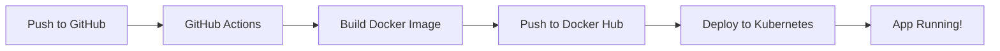
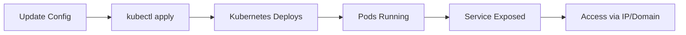

# ✅ Kubernetes Setup Complete!

Your Aorax project is now ready for Kubernetes deployment with full CI/CD pipeline.

## 📁 What Was Created

```
Aorax/
│
├── k8s/                              ← 🚀 ALL KUBERNETES FILES
│   ├── namespace.yaml                ← Creates isolated namespace
│   ├── configmap.yaml                ← Non-sensitive config (PORT, etc.)
│   ├── secret.yaml                   ← Sensitive data (DB, JWT, keys)
│   ├── secret.yaml.example           ← Template for secrets
│   ├── deployment.yaml               ← Main app deployment (3 replicas)
│   ├── service.yaml                  ← Exposes app (LoadBalancer + NodePort)
│   ├── ingress.yaml                  ← Domain routing & HTTPS
│   ├── hpa.yaml                      ← Auto-scaling (3-10 pods)
│   ├── README.md                     ← Complete documentation
│   └── DEPLOY.md                     ← Quick deployment guide
│
├── .github/
│   └── workflows/
│       └── deploy.yaml               ← GitHub Actions CI/CD pipeline
│
└── .gitignore                        ← Updated to exclude k8s/secret.yaml
```

---

## 🎯 Quick Start

### Option 1: Manual Deployment

```bash
# 1. Create your secrets file
cp k8s/secret.yaml.example k8s/secret.yaml

# 2. Edit and add your real credentials
notepad k8s/secret.yaml  # Windows
nano k8s/secret.yaml     # Linux/Mac

# 3. Update deployment image
# Edit k8s/deployment.yaml
# Change: image: your-dockerhub-username/aorax:latest

# 4. Deploy to Kubernetes
kubectl apply -f k8s/

# 5. Check status
kubectl get all -n aorax-production
kubectl logs -l app=aorax -n aorax-production -f
```

### Option 2: GitHub Actions Auto-Deploy

```bash
# 1. Set up GitHub secrets
# Go to: Settings → Secrets → Actions
# Add:
#   - DOCKER_USERNAME
#   - DOCKER_PASSWORD
#   - KUBE_CONFIG (base64 encoded)

# 2. Push to GitHub
git add .
git commit -m "Add Kubernetes deployment"
git push origin main

# GitHub Actions will automatically:
# ✅ Build Docker image
# ✅ Push to Docker Hub
# ✅ Deploy to Kubernetes
```

---

## 📋 Configuration Overview

### Namespace
- **Name**: `aorax-production`
- **Isolation**: Separate from other apps

### Deployment
- **Replicas**: 3 (for high availability)
- **Auto-scaling**: 3-10 pods based on CPU/Memory
- **Health checks**: Liveness, Readiness, Startup probes
- **Resources**: 
  - Requests: 256Mi memory, 250m CPU
  - Limits: 512Mi memory, 500m CPU

### Service
- **Type**: LoadBalancer (cloud) + NodePort (local)
- **Ports**: 
  - External: 80
  - Internal: 5000
  - NodePort: 30500

### Ingress (Optional)
- **Domain**: `api.aoraniti.com` (change this)
- **HTTPS**: Auto SSL with cert-manager
- **CORS**: Enabled

---

## 🔐 Security Configuration

### What Needs to be Updated in `k8s/secret.yaml`

```yaml
# Database credentials
DB_HOST: "your-production-db.example.com"
DB_USER: "your_db_user"
DB_PASSWORD: "your_secure_password"
DB_NAME: "aoraniti_db"

# JWT Secret (generate new)
JWT_SECRET: "run: openssl rand -base64 32"

# Encryption Key (must be 32 chars)
ENCRYPTION_KEY: "run: openssl rand -hex 16"

# Admin credentials (change after first login)
ADMIN_EMAIL: "admin@aoraniti.com"
ADMIN_PASSWORD: "ChangeThisPassword123!"
```

### Generate Secure Secrets

```bash
# JWT Secret
openssl rand -base64 32

# Encryption Key (32 chars)
openssl rand -hex 16

# Or use Node.js
node -e "console.log(require('crypto').randomBytes(32).toString('hex'))"
```

---

## 🚀 Deployment Workflow

### Automatic (GitHub Actions)



### Manual (kubectl)



---

## 📊 Monitoring Commands

```bash
# Get all resources
kubectl get all -n aorax-production

# Check pods
kubectl get pods -n aorax-production -w

# View logs
kubectl logs -l app=aorax -n aorax-production --tail=100 -f

# Check deployment
kubectl describe deployment aorax-deployment -n aorax-production

# Get service URL
kubectl get service aorax-service -n aorax-production

# Check auto-scaling
kubectl get hpa -n aorax-production
```

---

## 🔄 Update Deployment

### Update Image

```bash
# Build new version
docker build -t your-username/aorax:v2.0 .
docker push your-username/aorax:v2.0

# Update Kubernetes
kubectl set image deployment/aorax-deployment aorax=your-username/aorax:v2.0 -n aorax-production

# Watch rollout
kubectl rollout status deployment/aorax-deployment -n aorax-production
```

### Update Config

```bash
# Edit ConfigMap
kubectl edit configmap aorax-config -n aorax-production

# Restart to apply changes
kubectl rollout restart deployment/aorax-deployment -n aorax-production
```

### Rollback

```bash
# Rollback to previous version
kubectl rollout undo deployment/aorax-deployment -n aorax-production
```

---

## 🌐 Access Your Application

### Cloud (LoadBalancer)

```bash
# Get external IP
kubectl get service aorax-service -n aorax-production

# Output shows EXTERNAL-IP
# Access: http://<EXTERNAL-IP>
```

### Local (NodePort)

```bash
# Access via node IP and port 30500
# http://<NODE-IP>:30500

# For minikube:
minikube service aorax-service-nodeport -n aorax-production
```

### Development (Port Forward)

```bash
kubectl port-forward service/aorax-service 5000:80 -n aorax-production

# Access: http://localhost:5000
```

---

## 🎯 Features Included

✅ **High Availability**
- 3 replicas minimum
- Auto-scaling (3-10 pods)
- Rolling updates with zero downtime

✅ **Health Monitoring**
- Liveness probes (is app alive?)
- Readiness probes (ready for traffic?)
- Startup probes (has app started?)

✅ **Resource Management**
- CPU and memory limits
- Resource requests
- Horizontal Pod Autoscaler

✅ **Security**
- Non-root user
- Read-only root filesystem
- Security context configured
- Secrets management

✅ **CI/CD Pipeline**
- Automated builds
- Automated deployments
- Rollback capability
- Health checks after deploy

✅ **Networking**
- LoadBalancer service (cloud)
- NodePort service (local)
- Ingress for domain routing
- CORS configured

---

## 📝 GitHub Actions Secrets Setup

### Required Secrets

| Secret Name | Description | How to Get |
|-------------|-------------|------------|
| `DOCKER_USERNAME` | Docker Hub username | Your Docker Hub account |
| `DOCKER_PASSWORD` | Docker Hub token | Docker Hub → Settings → Security → New Access Token |
| `KUBE_CONFIG` | Kubernetes config | `cat ~/.kube/config \| base64 -w 0` |

### Setup Steps

1. Go to your GitHub repo
2. Click **Settings** → **Secrets and variables** → **Actions**
3. Click **New repository secret**
4. Add each secret above

---

## 🐛 Troubleshooting

### Pods Not Starting

```bash
# Check pod status
kubectl get pods -n aorax-production

# View pod details
kubectl describe pod <pod-name> -n aorax-production

# Check logs
kubectl logs <pod-name> -n aorax-production
```

### Database Connection Failed

```bash
# Exec into pod
kubectl exec -it <pod-name> -n aorax-production -- sh

# Check environment variables
env | grep DB_

# Test DB connection
nc -zv $DB_HOST 3306
```

### Service Not Accessible

```bash
# Check service endpoints
kubectl get endpoints aorax-service -n aorax-production

# Check if pods are ready
kubectl get pods -n aorax-production

# View service details
kubectl describe service aorax-service -n aorax-production
```

---

## 📚 Documentation

- **`k8s/README.md`** - Complete Kubernetes documentation
- **`k8s/DEPLOY.md`** - Quick deployment guide
- **`.github/workflows/deploy.yaml`** - CI/CD pipeline configuration

---

## ✅ Pre-Deployment Checklist

Before deploying to production:

- [ ] Create `k8s/secret.yaml` from `k8s/secret.yaml.example`
- [ ] Update all secrets with production values
- [ ] Update Docker image in `k8s/deployment.yaml`
- [ ] Configure GitHub secrets for CI/CD
- [ ] Verify database is accessible from cluster
- [ ] Update domain in `k8s/ingress.yaml` (if using)
- [ ] Test locally first: `kubectl apply -f k8s/`
- [ ] Verify health endpoint: `/health`
- [ ] Check logs for any errors
- [ ] Set up monitoring (Prometheus/Grafana)

---

## 🎉 You're Ready to Deploy!

### Next Steps

1. **Configure secrets**: Copy and update `k8s/secret.yaml.example`
2. **Update image**: Change Docker image in `k8s/deployment.yaml`
3. **Deploy**: Run `kubectl apply -f k8s/`
4. **Verify**: Check pods, logs, and service
5. **Access**: Get service URL and test API

### Need Help?

- Check `k8s/README.md` for detailed docs
- Check `k8s/DEPLOY.md` for quick start
- View logs: `kubectl logs -l app=aorax -n aorax-production -f`

---

**Status**: ✅ Ready for Production  
**Namespace**: `aorax-production`  
**Replicas**: 3-10 (auto-scaling)  
**Service**: LoadBalancer + NodePort  
**Health Checks**: ✅ Configured  
**CI/CD**: ✅ GitHub Actions Ready  

🚀 **Happy Deploying!**
